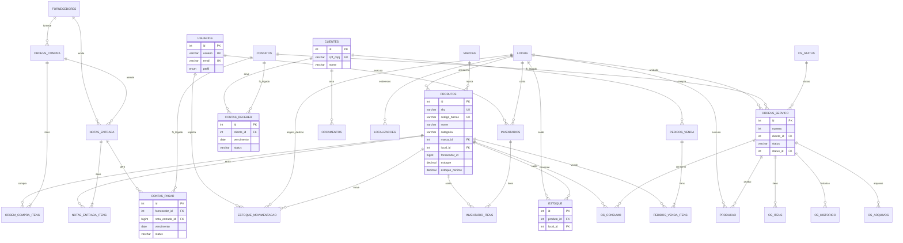

# EER — ERP Tem de Tudo (`temdetudo_db`)

Modelo extraído do MySQL 8.0.45 em 2026-08-29 e cruzado com as entidades JPA em `backend/src/main/java/com/temdetudo/erp/entity`.  
`ddl-auto=none`: o schema vive no MySQL. Scripts versionados:

| Arquivo | Função |
| --- | --- |
| `backend/src/main/resources/db/schema.sql` | Referência / bootstrap das tabelas de operação |
| `backend/src/main/resources/db/V20260829__indexes_views.sql` | FKs, índices e views aplicados no lab |
| Este arquivo | Relacionamentos, gaps JPA ↔ banco, satélites |

Não há arquivo `.mwb`. Diagrama abaixo (Mermaid) + SQL são o modelo.

## Diagrama (núcleo operacional)



## Entidades JPA ↔ tabelas reais

| JPA | Tabela MySQL | Relacionamentos reais |
| --- | --- | --- |
| `Usuario` | `usuarios` | `perfil` é **ENUM** (`ADMIN`,`GERENTE`,`FUNCIONARIO`), não FK para `perfis` |
| `Perfil` | *(enum Java)* | Tabela `perfis` existe (10 cargos: Admin, Gerente, …) e **não** é usada pelo JPA |
| `Produto` | `produtos` | `categoria` é **varchar** (não FK para `categorias`); `marca_id`→`marcas`; `local_id`→`locais`; `fornecedor_id` BIGINT sem FK (tipo ≠ `fornecedores.id` INT) |
| `Categoria` | `categorias` | Cadastro isolado; produto não referencia `id` |
| `Marca` | `marcas` | `produtos.marca_id` |
| `Cliente` | `clientes` | Usado por orçamentos/pedidos; contas a receber no banco apontam a `contatos` |
| — | `fornecedores` | Sem entidade JPA; IDs nas OCs/NFs/contas |
| `EstoqueMovimentacao` | `estoque_movimentacao` | `produto_id`→`produtos`; locais origem/destino→`locais`; `usuario_id`→`usuarios` |
| — | `estoque` | Saldo por produto+local (FKs já existiam) |
| `Inventario` / `InventarioItem` | `inventarios` / `inventario_itens` | local, usuário, produto |
| `OrdemCompra` / `OrdemCompraItem` | `ordens_compra` / `ordem_compra_itens` | Item `ordem_id` é INT e cabeçalho é BIGINT — **sem FK** |
| `NotaEntrada` / `NotaEntradaItem` | `notas_entrada` / `notas_entrada_itens` | NF→OC (bigint); item.produto_id BIGINT — **sem FK** para `produtos.id` INT |
| `Caixa` | `caixa` | Sem FK; `origem` + `referencia_id` polimórficos |
| `ContaPagar` | `contas_pagar` | `fornecedor_id`→**`contatos`** (legado); `nota_entrada_id`→`notas_entrada` |
| `ContaReceber` | `contas_receber` | `cliente_id`→**`contatos`** (legado) |
| `OrdemServico` | `ordens_servico` | JPA usa `numeroOS`, `cliente` string, `dataCriacao` — **colunas reais**: `numero`, `cliente_id`, `data_abertura`, … |
| `OsConsumo` | `os_consumo` | `os_id`/`produto_id` BIGINT — **sem FK** (tipos) |
| `Producao` | `producao` | `os_id`→`ordens_servico`; `local_id`→`locais` |
| `AgendaEvento` | `agenda_eventos` | Criada neste ajuste (JPA). Tabela legado: `agenda` (`data_inicio`/`data_fim`/`usuario_id`) |
| — | `locais` / `localizacoes` | Sem entidade JPA; `localizacoes.local_id` BIGINT vs `locais.id` INT |
| — | `permissoes` | **Não existe** no banco nem no JPA |

## FKs no MySQL

### Já existiam (mantidas)

- `estoque.produto_id` → `produtos.id`
- `estoque.local_id` → `locais.id`
- `contas_pagar.fornecedor_id` → `contatos.id`
- `contas_receber.cliente_id` → `contatos.id`
- `ordens_servico.cliente_id` → `contatos.id`
- `orcamentos.cliente_id` → `clientes.id`
- `contracheques.funcionario_id` → `funcionarios.id`

### Adicionadas em `V20260829__indexes_views.sql`

`produtos`→`marcas`/`locais`; `estoque_movimentacao`→`produtos`/`locais`/`usuarios`; `inventarios`/`inventario_itens`; `notas_entrada`→`ordens_compra`; `notas_entrada_itens`→`notas_entrada`; `contas_pagar.nota_entrada_id`→`notas_entrada`; `producao`→`ordens_servico`/`locais`; `ordens_servico`→`os_status`/`locais`; `os_itens`/`os_historico`/`os_arquivos`; `pedidos_venda`→`clientes`/`locais`; `pedidos_venda_itens`; `agenda`→`usuarios`.

### Inconsistência consciente (não alterada)

Contas e OS no banco tratam pessoa como `contatos`. O JPA e as telas de cadastro usam `clientes` / `fornecedores`. Reapontar essas FKs exigiria migração de dados — fora deste ajuste.

## Views

| View | Uso |
| --- | --- |
| `vw_produtos_estoque` | Produto + min/max + flag estoque baixo (`minimo > 0` e `estoque <= minimo`) / acima do máximo |
| `vw_estoque_baixo` | Recorte operacional (ativo e abaixo do mínimo) |
| `vw_contas_abertas` | Pagar + receber em aberto (join clientes/fornecedores **e** contatos) |
| `vw_os_resumo` | OS + cliente + status + totais de itens/consumo |
| `vw_caixa_resumo` | Totais por dia e tipo |
| `vw_producao_aberta` | Ordens de produção não finalizadas |

## Tabelas satélite (existem, sem entidade JPA neste backend)

`anuncios`, `campanhas`, `cobrancas`, `comissoes`, `comunicados`, `comunicados_funcionarios`, `contas_bancarias`, `contracheques`, `contratos`, `dashboard_cache`, `embalagens`, `empresas`, `entregas`, `extrato_bancario`, `funcionarios`, `metas_financeiras`, `metas_vendedores`, `orcamentos`, `pedidos_venda`, `produto_componentes`, `transferencias`, `os_arquivos`, `os_historico`, `os_itens`, `os_status`, `perfis`, `contatos`, `locais`, `localizacoes`.

## Como aplicar

```text
"C:\Program Files\MySQL\MySQL Server 8.0\bin\mysql.exe" -uroot -p temdetudo_db --default-character-set=utf8mb4 -e "source C:/Projetos/ERP-TemDeTudo/backend/src/main/resources/db/V20260829__indexes_views.sql"
```

Banco vazio: rode antes `schema.sql` (cria `temdetudo_db` e as tabelas de operação).
